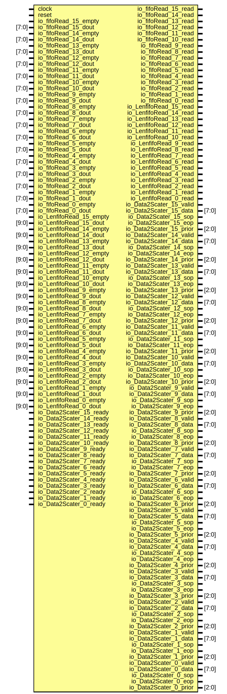

# Entity: ArbiterBridgeModel 
- **File**: ArbiterBridgeModel.v

## Diagram

## Ports

| Port name               | Direction | Type  | Description |
| ----------------------- | --------- | ----- | ----------- |
| clock                   | input     |       |             |
| reset                   | input     |       |             |
| io_fifoRead_15_read     | output    |       |             |
| io_fifoRead_15_empty    | input     |       |             |
| io_fifoRead_15_dout     | input     | [7:0] |             |
| io_fifoRead_14_read     | output    |       |             |
| io_fifoRead_14_empty    | input     |       |             |
| io_fifoRead_14_dout     | input     | [7:0] |             |
| io_fifoRead_13_read     | output    |       |             |
| io_fifoRead_13_empty    | input     |       |             |
| io_fifoRead_13_dout     | input     | [7:0] |             |
| io_fifoRead_12_read     | output    |       |             |
| io_fifoRead_12_empty    | input     |       |             |
| io_fifoRead_12_dout     | input     | [7:0] |             |
| io_fifoRead_11_read     | output    |       |             |
| io_fifoRead_11_empty    | input     |       |             |
| io_fifoRead_11_dout     | input     | [7:0] |             |
| io_fifoRead_10_read     | output    |       |             |
| io_fifoRead_10_empty    | input     |       |             |
| io_fifoRead_10_dout     | input     | [7:0] |             |
| io_fifoRead_9_read      | output    |       |             |
| io_fifoRead_9_empty     | input     |       |             |
| io_fifoRead_9_dout      | input     | [7:0] |             |
| io_fifoRead_8_read      | output    |       |             |
| io_fifoRead_8_empty     | input     |       |             |
| io_fifoRead_8_dout      | input     | [7:0] |             |
| io_fifoRead_7_read      | output    |       |             |
| io_fifoRead_7_empty     | input     |       |             |
| io_fifoRead_7_dout      | input     | [7:0] |             |
| io_fifoRead_6_read      | output    |       |             |
| io_fifoRead_6_empty     | input     |       |             |
| io_fifoRead_6_dout      | input     | [7:0] |             |
| io_fifoRead_5_read      | output    |       |             |
| io_fifoRead_5_empty     | input     |       |             |
| io_fifoRead_5_dout      | input     | [7:0] |             |
| io_fifoRead_4_read      | output    |       |             |
| io_fifoRead_4_empty     | input     |       |             |
| io_fifoRead_4_dout      | input     | [7:0] |             |
| io_fifoRead_3_read      | output    |       |             |
| io_fifoRead_3_empty     | input     |       |             |
| io_fifoRead_3_dout      | input     | [7:0] |             |
| io_fifoRead_2_read      | output    |       |             |
| io_fifoRead_2_empty     | input     |       |             |
| io_fifoRead_2_dout      | input     | [7:0] |             |
| io_fifoRead_1_read      | output    |       |             |
| io_fifoRead_1_empty     | input     |       |             |
| io_fifoRead_1_dout      | input     | [7:0] |             |
| io_fifoRead_0_read      | output    |       |  第一个FIFO读取端口的读取信号           |
| io_fifoRead_0_empty     | input     |       |   第一个FIFO读取端口的空信号          |
| io_fifoRead_0_dout      | input     | [7:0] |  第一个FIFO读取端口的数据输出           |
| io_LenfifoRead_15_read  | output    |       |             |
| io_LenfifoRead_15_empty | input     |       |             |
| io_LenfifoRead_15_dout  | input     | [9:0] |             |
| io_LenfifoRead_14_read  | output    |       |             |
| io_LenfifoRead_14_empty | input     |       |             |
| io_LenfifoRead_14_dout  | input     | [9:0] |             |
| io_LenfifoRead_13_read  | output    |       |             |
| io_LenfifoRead_13_empty | input     |       |             |
| io_LenfifoRead_13_dout  | input     | [9:0] |             |
| io_LenfifoRead_12_read  | output    |       |             |
| io_LenfifoRead_12_empty | input     |       |             |
| io_LenfifoRead_12_dout  | input     | [9:0] |             |
| io_LenfifoRead_11_read  | output    |       |             |
| io_LenfifoRead_11_empty | input     |       |             |
| io_LenfifoRead_11_dout  | input     | [9:0] |             |
| io_LenfifoRead_10_read  | output    |       |             |
| io_LenfifoRead_10_empty | input     |       |             |
| io_LenfifoRead_10_dout  | input     | [9:0] |             |
| io_LenfifoRead_9_read   | output    |       |             |
| io_LenfifoRead_9_empty  | input     |       |             |
| io_LenfifoRead_9_dout   | input     | [9:0] |             |
| io_LenfifoRead_8_read   | output    |       |             |
| io_LenfifoRead_8_empty  | input     |       |             |
| io_LenfifoRead_8_dout   | input     | [9:0] |             |
| io_LenfifoRead_7_read   | output    |       |             |
| io_LenfifoRead_7_empty  | input     |       |             |
| io_LenfifoRead_7_dout   | input     | [9:0] |             |
| io_LenfifoRead_6_read   | output    |       |             |
| io_LenfifoRead_6_empty  | input     |       |             |
| io_LenfifoRead_6_dout   | input     | [9:0] |             |
| io_LenfifoRead_5_read   | output    |       |             |
| io_LenfifoRead_5_empty  | input     |       |             |
| io_LenfifoRead_5_dout   | input     | [9:0] |             |
| io_LenfifoRead_4_read   | output    |       |             |
| io_LenfifoRead_4_empty  | input     |       |             |
| io_LenfifoRead_4_dout   | input     | [9:0] |             |
| io_LenfifoRead_3_read   | output    |       |             |
| io_LenfifoRead_3_empty  | input     |       |             |
| io_LenfifoRead_3_dout   | input     | [9:0] |             |
| io_LenfifoRead_2_read   | output    |       |             |
| io_LenfifoRead_2_empty  | input     |       |             |
| io_LenfifoRead_2_dout   | input     | [9:0] |             |
| io_LenfifoRead_1_read   | output    |       |             |
| io_LenfifoRead_1_empty  | input     |       |             |
| io_LenfifoRead_1_dout   | input     | [9:0] |             |
| io_LenfifoRead_0_read   | output    |       | 第一个长度FIFO读取端口的读取信号            |
| io_LenfifoRead_0_empty  | input     |       |第一个长度FIFO读取端口的空信号             |
| io_LenfifoRead_0_dout   | input     | [9:0] |  第一个长度FIFO读取端口的数据输出           |
| io_Data2Scater_15_valid | output    |       |             |
| io_Data2Scater_15_data  | output    | [7:0] |             |
| io_Data2Scater_15_sop   | output    |       |             |
| io_Data2Scater_15_eop   | output    |       |             |
| io_Data2Scater_15_prior | output    | [2:0] |             |
| io_Data2Scater_15_ready | input     |       |             |
| io_Data2Scater_14_valid | output    |       |             |
| io_Data2Scater_14_data  | output    | [7:0] |             |
| io_Data2Scater_14_sop   | output    |       |             |
| io_Data2Scater_14_eop   | output    |       |             |
| io_Data2Scater_14_prior | output    | [2:0] |             |
| io_Data2Scater_14_ready | input     |       |             |
| io_Data2Scater_13_valid | output    |       |             |
| io_Data2Scater_13_data  | output    | [7:0] |             |
| io_Data2Scater_13_sop   | output    |       |             |
| io_Data2Scater_13_eop   | output    |       |             |
| io_Data2Scater_13_prior | output    | [2:0] |             |
| io_Data2Scater_13_ready | input     |       |             |
| io_Data2Scater_12_valid | output    |       |             |
| io_Data2Scater_12_data  | output    | [7:0] |             |
| io_Data2Scater_12_sop   | output    |       |             |
| io_Data2Scater_12_eop   | output    |       |             |
| io_Data2Scater_12_prior | output    | [2:0] |             |
| io_Data2Scater_12_ready | input     |       |             |
| io_Data2Scater_11_valid | output    |       |             |
| io_Data2Scater_11_data  | output    | [7:0] |             |
| io_Data2Scater_11_sop   | output    |       |             |
| io_Data2Scater_11_eop   | output    |       |             |
| io_Data2Scater_11_prior | output    | [2:0] |             |
| io_Data2Scater_11_ready | input     |       |             |
| io_Data2Scater_10_valid | output    |       |             |
| io_Data2Scater_10_data  | output    | [7:0] |             |
| io_Data2Scater_10_sop   | output    |       |             |
| io_Data2Scater_10_eop   | output    |       |             |
| io_Data2Scater_10_prior | output    | [2:0] |             |
| io_Data2Scater_10_ready | input     |       |             |
| io_Data2Scater_9_valid  | output    |       |             |
| io_Data2Scater_9_data   | output    | [7:0] |             |
| io_Data2Scater_9_sop    | output    |       |             |
| io_Data2Scater_9_eop    | output    |       |             |
| io_Data2Scater_9_prior  | output    | [2:0] |             |
| io_Data2Scater_9_ready  | input     |       |             |
| io_Data2Scater_8_valid  | output    |       |             |
| io_Data2Scater_8_data   | output    | [7:0] |             |
| io_Data2Scater_8_sop    | output    |       |             |
| io_Data2Scater_8_eop    | output    |       |             |
| io_Data2Scater_8_prior  | output    | [2:0] |             |
| io_Data2Scater_8_ready  | input     |       |             |
| io_Data2Scater_7_valid  | output    |       |             |
| io_Data2Scater_7_data   | output    | [7:0] |             |
| io_Data2Scater_7_sop    | output    |       |             |
| io_Data2Scater_7_eop    | output    |       |             |
| io_Data2Scater_7_prior  | output    | [2:0] |             |
| io_Data2Scater_7_ready  | input     |       |             |
| io_Data2Scater_6_valid  | output    |       |             |
| io_Data2Scater_6_data   | output    | [7:0] |             |
| io_Data2Scater_6_sop    | output    |       |             |
| io_Data2Scater_6_eop    | output    |       |             |
| io_Data2Scater_6_prior  | output    | [2:0] |             |
| io_Data2Scater_6_ready  | input     |       |             |
| io_Data2Scater_5_valid  | output    |       |             |
| io_Data2Scater_5_data   | output    | [7:0] |             |
| io_Data2Scater_5_sop    | output    |       |             |
| io_Data2Scater_5_eop    | output    |       |             |
| io_Data2Scater_5_prior  | output    | [2:0] |             |
| io_Data2Scater_5_ready  | input     |       |             |
| io_Data2Scater_4_valid  | output    |       |             |
| io_Data2Scater_4_data   | output    | [7:0] |             |
| io_Data2Scater_4_sop    | output    |       |             |
| io_Data2Scater_4_eop    | output    |       |             |
| io_Data2Scater_4_prior  | output    | [2:0] |             |
| io_Data2Scater_4_ready  | input     |       |             |
| io_Data2Scater_3_valid  | output    |       |             |
| io_Data2Scater_3_data   | output    | [7:0] |             |
| io_Data2Scater_3_sop    | output    |       |             |
| io_Data2Scater_3_eop    | output    |       |             |
| io_Data2Scater_3_prior  | output    | [2:0] |             |
| io_Data2Scater_3_ready  | input     |       |             |
| io_Data2Scater_2_valid  | output    |       |             |
| io_Data2Scater_2_data   | output    | [7:0] |             |
| io_Data2Scater_2_sop    | output    |       |             |
| io_Data2Scater_2_eop    | output    |       |             |
| io_Data2Scater_2_prior  | output    | [2:0] |             |
| io_Data2Scater_2_ready  | input     |       |             |
| io_Data2Scater_1_valid  | output    |       |             |
| io_Data2Scater_1_data   | output    | [7:0] |             |
| io_Data2Scater_1_sop    | output    |       |             |
| io_Data2Scater_1_eop    | output    |       |             |
| io_Data2Scater_1_prior  | output    | [2:0] |             |
| io_Data2Scater_1_ready  | input     |       |             |
| io_Data2Scater_0_valid  | output    |       | 第一个数据分散模块的有效信号            |
| io_Data2Scater_0_data   | output    | [7:0] | 第一个数据分散模块的数据输出            |
| io_Data2Scater_0_sop    | output    |       |  第一个数据分散模块的开始信号           |
| io_Data2Scater_0_eop    | output    |       | 第一个数据分散模块的结束信号            |
| io_Data2Scater_0_prior  | output    | [2:0] | 第一个数据分散模块的优先级信号            |
| io_Data2Scater_0_ready  | input     |       | 第一个数据分散模块的就绪信号            |

## Instantiations

- arbiter: ArbiterBridge
通过仲裁模块，根据输入端口的数据转发到对应的目的端口

首先从Fifo里读出数据，根据该数据的目的端口，将其转发到对应的数据分散模块
注意支持16个端口同时读写，
相当于一个多master 多slave的总线桥 实现可参考AHB APB。