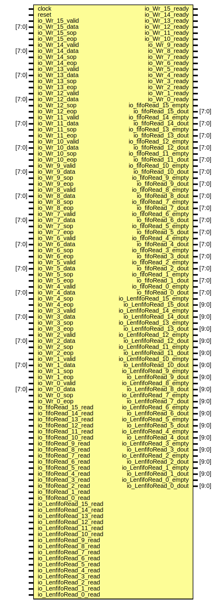

# Entity: DataInControlModel 
- **File**: DataInControlModel.v

## Diagram

## Ports

| Port name               | Direction | Type  | Description |
| ----------------------- | --------- | ----- | ----------- |
| clock                   | input     |       |             |
| reset                   | input     |       |             |
| io_Wr_15_valid          | input     |       |             |
| io_Wr_15_data           | input     | [7:0] |             |
| io_Wr_15_ready          | output    |       |             |
| io_Wr_15_sop            | input     |       |             |
| io_Wr_15_eop            | input     |       |             |
| io_Wr_14_valid          | input     |       |             |
| io_Wr_14_data           | input     | [7:0] |             |
| io_Wr_14_ready          | output    |       |             |
| io_Wr_14_sop            | input     |       |             |
| io_Wr_14_eop            | input     |       |             |
| io_Wr_13_valid          | input     |       |             |
| io_Wr_13_data           | input     | [7:0] |             |
| io_Wr_13_ready          | output    |       |             |
| io_Wr_13_sop            | input     |       |             |
| io_Wr_13_eop            | input     |       |             |
| io_Wr_12_valid          | input     |       |             |
| io_Wr_12_data           | input     | [7:0] |             |
| io_Wr_12_ready          | output    |       |             |
| io_Wr_12_sop            | input     |       |             |
| io_Wr_12_eop            | input     |       |             |
| io_Wr_11_valid          | input     |       |             |
| io_Wr_11_data           | input     | [7:0] |             |
| io_Wr_11_ready          | output    |       |             |
| io_Wr_11_sop            | input     |       |             |
| io_Wr_11_eop            | input     |       |             |
| io_Wr_10_valid          | input     |       |             |
| io_Wr_10_data           | input     | [7:0] |             |
| io_Wr_10_ready          | output    |       |             |
| io_Wr_10_sop            | input     |       |             |
| io_Wr_10_eop            | input     |       |             |
| io_Wr_9_valid           | input     |       |             |
| io_Wr_9_data            | input     | [7:0] |             |
| io_Wr_9_ready           | output    |       |             |
| io_Wr_9_sop             | input     |       |             |
| io_Wr_9_eop             | input     |       |             |
| io_Wr_8_valid           | input     |       |             |
| io_Wr_8_data            | input     | [7:0] |             |
| io_Wr_8_ready           | output    |       |             |
| io_Wr_8_sop             | input     |       |             |
| io_Wr_8_eop             | input     |       |             |
| io_Wr_7_valid           | input     |       |             |
| io_Wr_7_data            | input     | [7:0] |             |
| io_Wr_7_ready           | output    |       |             |
| io_Wr_7_sop             | input     |       |             |
| io_Wr_7_eop             | input     |       |             |
| io_Wr_6_valid           | input     |       |             |
| io_Wr_6_data            | input     | [7:0] |             |
| io_Wr_6_ready           | output    |       |             |
| io_Wr_6_sop             | input     |       |             |
| io_Wr_6_eop             | input     |       |             |
| io_Wr_5_valid           | input     |       |             |
| io_Wr_5_data            | input     | [7:0] |             |
| io_Wr_5_ready           | output    |       |             |
| io_Wr_5_sop             | input     |       |             |
| io_Wr_5_eop             | input     |       |             |
| io_Wr_4_valid           | input     |       |             |
| io_Wr_4_data            | input     | [7:0] |             |
| io_Wr_4_ready           | output    |       |             |
| io_Wr_4_sop             | input     |       |             |
| io_Wr_4_eop             | input     |       |             |
| io_Wr_3_valid           | input     |       |             |
| io_Wr_3_data            | input     | [7:0] |             |
| io_Wr_3_ready           | output    |       |             |
| io_Wr_3_sop             | input     |       |             |
| io_Wr_3_eop             | input     |       |             |
| io_Wr_2_valid           | input     |       |             |
| io_Wr_2_data            | input     | [7:0] |             |
| io_Wr_2_ready           | output    |       |             |
| io_Wr_2_sop             | input     |       |             |
| io_Wr_2_eop             | input     |       |             |
| io_Wr_1_valid           | input     |       |             |
| io_Wr_1_data            | input     | [7:0] |             |
| io_Wr_1_ready           | output    |       |             |
| io_Wr_1_sop             | input     |       |             |
| io_Wr_1_eop             | input     |       |             |
| io_Wr_0_valid           | input     |       |             |
| io_Wr_0_data            | input     | [7:0] |             |
| io_Wr_0_ready           | output    |       |             |
| io_Wr_0_sop             | input     |       |             |
| io_Wr_0_eop             | input     |       |             |
| io_fifoRead_15_read     | input     |       |             |
| io_fifoRead_15_empty    | output    |       |             |
| io_fifoRead_15_dout     | output    | [7:0] |             |
| io_fifoRead_14_read     | input     |       |             |
| io_fifoRead_14_empty    | output    |       |             |
| io_fifoRead_14_dout     | output    | [7:0] |             |
| io_fifoRead_13_read     | input     |       |             |
| io_fifoRead_13_empty    | output    |       |             |
| io_fifoRead_13_dout     | output    | [7:0] |             |
| io_fifoRead_12_read     | input     |       |             |
| io_fifoRead_12_empty    | output    |       |             |
| io_fifoRead_12_dout     | output    | [7:0] |             |
| io_fifoRead_11_read     | input     |       |             |
| io_fifoRead_11_empty    | output    |       |             |
| io_fifoRead_11_dout     | output    | [7:0] |             |
| io_fifoRead_10_read     | input     |       |             |
| io_fifoRead_10_empty    | output    |       |             |
| io_fifoRead_10_dout     | output    | [7:0] |             |
| io_fifoRead_9_read      | input     |       |             |
| io_fifoRead_9_empty     | output    |       |             |
| io_fifoRead_9_dout      | output    | [7:0] |             |
| io_fifoRead_8_read      | input     |       |             |
| io_fifoRead_8_empty     | output    |       |             |
| io_fifoRead_8_dout      | output    | [7:0] |             |
| io_fifoRead_7_read      | input     |       |             |
| io_fifoRead_7_empty     | output    |       |             |
| io_fifoRead_7_dout      | output    | [7:0] |             |
| io_fifoRead_6_read      | input     |       |             |
| io_fifoRead_6_empty     | output    |       |             |
| io_fifoRead_6_dout      | output    | [7:0] |             |
| io_fifoRead_5_read      | input     |       |             |
| io_fifoRead_5_empty     | output    |       |             |
| io_fifoRead_5_dout      | output    | [7:0] |             |
| io_fifoRead_4_read      | input     |       |             |
| io_fifoRead_4_empty     | output    |       |             |
| io_fifoRead_4_dout      | output    | [7:0] |             |
| io_fifoRead_3_read      | input     |       |             |
| io_fifoRead_3_empty     | output    |       |             |
| io_fifoRead_3_dout      | output    | [7:0] |             |
| io_fifoRead_2_read      | input     |       |             |
| io_fifoRead_2_empty     | output    |       |             |
| io_fifoRead_2_dout      | output    | [7:0] |             |
| io_fifoRead_1_read      | input     |       |             |
| io_fifoRead_1_empty     | output    |       |             |
| io_fifoRead_1_dout      | output    | [7:0] |             |
| io_fifoRead_0_read      | input     |       |             |
| io_fifoRead_0_empty     | output    |       |             |
| io_fifoRead_0_dout      | output    | [7:0] |             |
| io_LenfifoRead_15_read  | input     |       |             |
| io_LenfifoRead_15_empty | output    |       |             |
| io_LenfifoRead_15_dout  | output    | [9:0] |             |
| io_LenfifoRead_14_read  | input     |       |             |
| io_LenfifoRead_14_empty | output    |       |             |
| io_LenfifoRead_14_dout  | output    | [9:0] |             |
| io_LenfifoRead_13_read  | input     |       |             |
| io_LenfifoRead_13_empty | output    |       |             |
| io_LenfifoRead_13_dout  | output    | [9:0] |             |
| io_LenfifoRead_12_read  | input     |       |             |
| io_LenfifoRead_12_empty | output    |       |             |
| io_LenfifoRead_12_dout  | output    | [9:0] |             |
| io_LenfifoRead_11_read  | input     |       |             |
| io_LenfifoRead_11_empty | output    |       |             |
| io_LenfifoRead_11_dout  | output    | [9:0] |             |
| io_LenfifoRead_10_read  | input     |       |             |
| io_LenfifoRead_10_empty | output    |       |             |
| io_LenfifoRead_10_dout  | output    | [9:0] |             |
| io_LenfifoRead_9_read   | input     |       |             |
| io_LenfifoRead_9_empty  | output    |       |             |
| io_LenfifoRead_9_dout   | output    | [9:0] |             |
| io_LenfifoRead_8_read   | input     |       |             |
| io_LenfifoRead_8_empty  | output    |       |             |
| io_LenfifoRead_8_dout   | output    | [9:0] |             |
| io_LenfifoRead_7_read   | input     |       |             |
| io_LenfifoRead_7_empty  | output    |       |             |
| io_LenfifoRead_7_dout   | output    | [9:0] |             |
| io_LenfifoRead_6_read   | input     |       |             |
| io_LenfifoRead_6_empty  | output    |       |             |
| io_LenfifoRead_6_dout   | output    | [9:0] |             |
| io_LenfifoRead_5_read   | input     |       |             |
| io_LenfifoRead_5_empty  | output    |       |             |
| io_LenfifoRead_5_dout   | output    | [9:0] |             |
| io_LenfifoRead_4_read   | input     |       |             |
| io_LenfifoRead_4_empty  | output    |       |             |
| io_LenfifoRead_4_dout   | output    | [9:0] |             |
| io_LenfifoRead_3_read   | input     |       |             |
| io_LenfifoRead_3_empty  | output    |       |             |
| io_LenfifoRead_3_dout   | output    | [9:0] |             |
| io_LenfifoRead_2_read   | input     |       |             |
| io_LenfifoRead_2_empty  | output    |       |             |
| io_LenfifoRead_2_dout   | output    | [9:0] |             |
| io_LenfifoRead_1_read   | input     |       |             |
| io_LenfifoRead_1_empty  | output    |       |             |
| io_LenfifoRead_1_dout   | output    | [9:0] |             |
| io_LenfifoRead_0_read   | input     |       |             |
| io_LenfifoRead_0_empty  | output    |       |             |
| io_LenfifoRead_0_dout   | output    | [9:0] |             |

## Instantiations

- dataincontrol: DataInControl
数据输入处理模块
功能：
状态机处理数据的输入，当数据输入时，根据数据的sop和eop标志位，判断数据的开始和结束
将数据写入fifo，当前数据包的长度写入长度fifo中
向Arbiter提供fifo的读接口