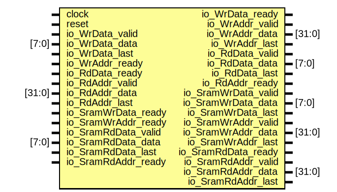

# Entity: MMUModel 
- **File**: MMUModel.v

## Diagram

## Ports

| Port name           | Direction | Type   | Description |
| ------------------- | --------- | ------ | ----------- |
| clock               | input     |        |             |
| reset               | input     |        |             |
| io_WrData_valid     | input     |        |             |
| io_WrData_data      | input     | [7:0]  |             |
| io_WrData_ready     | output    |        |             |
| io_WrData_last      | input     |        |             |
| io_WrAddr_valid     | output    |        |             |
| io_WrAddr_data      | output    | [31:0] |             |
| io_WrAddr_ready     | input     |        |             |
| io_WrAddr_last      | output    |        |             |
| io_RdData_valid     | output    |        |             |
| io_RdData_data      | output    | [7:0]  |             |
| io_RdData_ready     | input     |        |             |
| io_RdData_last      | output    |        |             |
| io_RdAddr_valid     | input     |        |             |
| io_RdAddr_data      | input     | [31:0] |             |
| io_RdAddr_ready     | output    |        |             |
| io_RdAddr_last      | input     |        |             |
| io_SramWrData_valid | output    |        |             |
| io_SramWrData_data  | output    | [7:0]  |             |
| io_SramWrData_ready | input     |        |             |
| io_SramWrData_last  | output    |        |             |
| io_SramWrAddr_valid | output    |        |             |
| io_SramWrAddr_data  | output    | [31:0] |             |
| io_SramWrAddr_ready | input     |        |             |
| io_SramWrAddr_last  | output    |        |             |
| io_SramRdData_valid | input     |        |             |
| io_SramRdData_data  | input     | [7:0]  |             |
| io_SramRdData_ready | output    |        |             |
| io_SramRdData_last  | input     |        |             |
| io_SramRdAddr_valid | output    |        |             |
| io_SramRdAddr_data  | output    | [31:0] |             |
| io_SramRdAddr_ready | input     |        |             |
| io_SramRdAddr_last  | output    |        |             |

## Instantiations

- mmu: MMU

功能：
1.接受ScatterCollecter发送的写数据请求，返回当前拆包后数据写入的首地址，
该模块接受ScatterCollecter传入的数据，当能写入的地址不连续时，返回当前数据包写入的首地址，
继续接受数据，直到数据包写入完成，每一包数据都返回一个地址，
2.接受ScatterCollecter发送的读数据请求，根据传入的数据首地址，和数据包的长度，
读取数据，返回给ScatterCollecter
3.将数据写和读的信息转发给SramControl模块。

该模块内部管理内存的分配和释放

