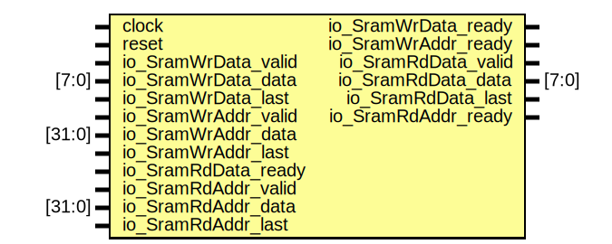

# Entity: SramControlModel 
- **File**: SramControlModel.v

## Diagram

## Ports

| Port name         | Direction | Type    | Description |
| ----------------- | --------- | ------- | ----------- |
| clock             | input     |         |             |
| reset             | input     |         |             |
| io_SramWr_awready | output    |         |             |
| io_SramWr_awvalid | input     |         |             |
| io_SramWr_awaddr  | input     | [35:0]  |             |
| io_SramWr_awlen   | input     | [7:0]   |             |
| io_SramWr_wready  | output    |         |             |
| io_SramWr_wvalid  | input     |         |             |
| io_SramWr_wdata   | input     | [255:0] |             |
| io_SramWr_wlast   | input     |         |             |
| io_SramRd_arready | output    |         |             |
| io_SramRd_arvalid | input     |         |             |
| io_SramRd_araddr  | input     | [35:0]  |             |
| io_SramRd_arlen   | input     | [7:0]   |             |
| io_SramRd_rready  | input     |         |             |
| io_SramRd_rvalid  | output    |         |             |
| io_SramRd_rdata   | output    | [255:0] |             |
| io_SramRd_rlast   | output    |         |             |

## Instantiations

- sramcontrol: SramControl
SramControl 模块
功能：
1.接受MMU发送的写数据请求，根据地址写入数据
2.接受MMU发送的读数据请求，根据地址读取数据
3.将数据写和读的信息转发给MMU模块。
4.控制内部的Sram存储器