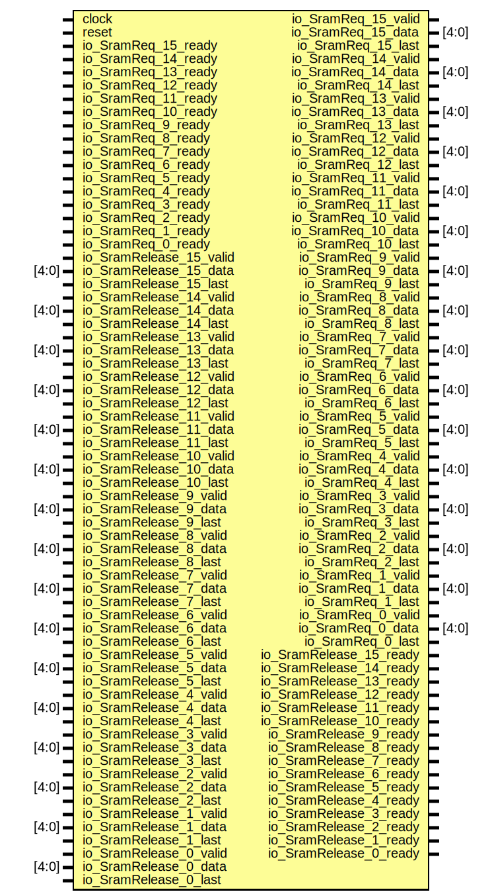

# Entity: SramManagerModel 
- **File**: SramManagerModel.v

## Diagram

## Ports

| Port name               | Direction | Type  | Description |
| ----------------------- | --------- | ----- | ----------- |
| clock                   | input     |       |             |
| reset                   | input     |       |             |
| io_SramReq_15_valid     | output    |       |             |
| io_SramReq_15_data      | output    | [4:0] |             |
| io_SramReq_15_ready     | input     |       |             |
| io_SramReq_15_last      | output    |       |             |
| io_SramReq_14_valid     | output    |       |             |
| io_SramReq_14_data      | output    | [4:0] |             |
| io_SramReq_14_ready     | input     |       |             |
| io_SramReq_14_last      | output    |       |             |
| io_SramReq_13_valid     | output    |       |             |
| io_SramReq_13_data      | output    | [4:0] |             |
| io_SramReq_13_ready     | input     |       |             |
| io_SramReq_13_last      | output    |       |             |
| io_SramReq_12_valid     | output    |       |             |
| io_SramReq_12_data      | output    | [4:0] |             |
| io_SramReq_12_ready     | input     |       |             |
| io_SramReq_12_last      | output    |       |             |
| io_SramReq_11_valid     | output    |       |             |
| io_SramReq_11_data      | output    | [4:0] |             |
| io_SramReq_11_ready     | input     |       |             |
| io_SramReq_11_last      | output    |       |             |
| io_SramReq_10_valid     | output    |       |             |
| io_SramReq_10_data      | output    | [4:0] |             |
| io_SramReq_10_ready     | input     |       |             |
| io_SramReq_10_last      | output    |       |             |
| io_SramReq_9_valid      | output    |       |             |
| io_SramReq_9_data       | output    | [4:0] |             |
| io_SramReq_9_ready      | input     |       |             |
| io_SramReq_9_last       | output    |       |             |
| io_SramReq_8_valid      | output    |       |             |
| io_SramReq_8_data       | output    | [4:0] |             |
| io_SramReq_8_ready      | input     |       |             |
| io_SramReq_8_last       | output    |       |             |
| io_SramReq_7_valid      | output    |       |             |
| io_SramReq_7_data       | output    | [4:0] |             |
| io_SramReq_7_ready      | input     |       |             |
| io_SramReq_7_last       | output    |       |             |
| io_SramReq_6_valid      | output    |       |             |
| io_SramReq_6_data       | output    | [4:0] |             |
| io_SramReq_6_ready      | input     |       |             |
| io_SramReq_6_last       | output    |       |             |
| io_SramReq_5_valid      | output    |       |             |
| io_SramReq_5_data       | output    | [4:0] |             |
| io_SramReq_5_ready      | input     |       |             |
| io_SramReq_5_last       | output    |       |             |
| io_SramReq_4_valid      | output    |       |             |
| io_SramReq_4_data       | output    | [4:0] |             |
| io_SramReq_4_ready      | input     |       |             |
| io_SramReq_4_last       | output    |       |             |
| io_SramReq_3_valid      | output    |       |             |
| io_SramReq_3_data       | output    | [4:0] |             |
| io_SramReq_3_ready      | input     |       |             |
| io_SramReq_3_last       | output    |       |             |
| io_SramReq_2_valid      | output    |       |             |
| io_SramReq_2_data       | output    | [4:0] |             |
| io_SramReq_2_ready      | input     |       |             |
| io_SramReq_2_last       | output    |       |             |
| io_SramReq_1_valid      | output    |       |             |
| io_SramReq_1_data       | output    | [4:0] |             |
| io_SramReq_1_ready      | input     |       |             |
| io_SramReq_1_last       | output    |       |             |
| io_SramReq_0_valid      | output    |       |             |
| io_SramReq_0_data       | output    | [4:0] |             |
| io_SramReq_0_ready      | input     |       |             |
| io_SramReq_0_last       | output    |       |             |
| io_SramRelease_15_valid | input     |       |             |
| io_SramRelease_15_data  | input     | [4:0] |             |
| io_SramRelease_15_ready | output    |       |             |
| io_SramRelease_15_last  | input     |       |             |
| io_SramRelease_14_valid | input     |       |             |
| io_SramRelease_14_data  | input     | [4:0] |             |
| io_SramRelease_14_ready | output    |       |             |
| io_SramRelease_14_last  | input     |       |             |
| io_SramRelease_13_valid | input     |       |             |
| io_SramRelease_13_data  | input     | [4:0] |             |
| io_SramRelease_13_ready | output    |       |             |
| io_SramRelease_13_last  | input     |       |             |
| io_SramRelease_12_valid | input     |       |             |
| io_SramRelease_12_data  | input     | [4:0] |             |
| io_SramRelease_12_ready | output    |       |             |
| io_SramRelease_12_last  | input     |       |             |
| io_SramRelease_11_valid | input     |       |             |
| io_SramRelease_11_data  | input     | [4:0] |             |
| io_SramRelease_11_ready | output    |       |             |
| io_SramRelease_11_last  | input     |       |             |
| io_SramRelease_10_valid | input     |       |             |
| io_SramRelease_10_data  | input     | [4:0] |             |
| io_SramRelease_10_ready | output    |       |             |
| io_SramRelease_10_last  | input     |       |             |
| io_SramRelease_9_valid  | input     |       |             |
| io_SramRelease_9_data   | input     | [4:0] |             |
| io_SramRelease_9_ready  | output    |       |             |
| io_SramRelease_9_last   | input     |       |             |
| io_SramRelease_8_valid  | input     |       |             |
| io_SramRelease_8_data   | input     | [4:0] |             |
| io_SramRelease_8_ready  | output    |       |             |
| io_SramRelease_8_last   | input     |       |             |
| io_SramRelease_7_valid  | input     |       |             |
| io_SramRelease_7_data   | input     | [4:0] |             |
| io_SramRelease_7_ready  | output    |       |             |
| io_SramRelease_7_last   | input     |       |             |
| io_SramRelease_6_valid  | input     |       |             |
| io_SramRelease_6_data   | input     | [4:0] |             |
| io_SramRelease_6_ready  | output    |       |             |
| io_SramRelease_6_last   | input     |       |             |
| io_SramRelease_5_valid  | input     |       |             |
| io_SramRelease_5_data   | input     | [4:0] |             |
| io_SramRelease_5_ready  | output    |       |             |
| io_SramRelease_5_last   | input     |       |             |
| io_SramRelease_4_valid  | input     |       |             |
| io_SramRelease_4_data   | input     | [4:0] |             |
| io_SramRelease_4_ready  | output    |       |             |
| io_SramRelease_4_last   | input     |       |             |
| io_SramRelease_3_valid  | input     |       |             |
| io_SramRelease_3_data   | input     | [4:0] |             |
| io_SramRelease_3_ready  | output    |       |             |
| io_SramRelease_3_last   | input     |       |             |
| io_SramRelease_2_valid  | input     |       |             |
| io_SramRelease_2_data   | input     | [4:0] |             |
| io_SramRelease_2_ready  | output    |       |             |
| io_SramRelease_2_last   | input     |       |             |
| io_SramRelease_1_valid  | input     |       |             |
| io_SramRelease_1_data   | input     | [4:0] |             |
| io_SramRelease_1_ready  | output    |       |             |
| io_SramRelease_1_last   | input     |       |             |
| io_SramRelease_0_valid  | input     |       |             |
| io_SramRelease_0_data   | input     | [4:0] |             |
| io_SramRelease_0_ready  | output    |       |             |
| io_SramRelease_0_last   | input     |       |             |

## Instantiations

- srammanager: SramManager
实现一个Sram分配模块 最小分配单元是一块Sram，即1KB 

当某个通道有写入请求时，首先向该模块发送一个请求分配。然后该模块将空闲的Sram分配给该通道

当某个通道的数据全部读出后，向该模块发送一个释放请求，将该Sram释放。